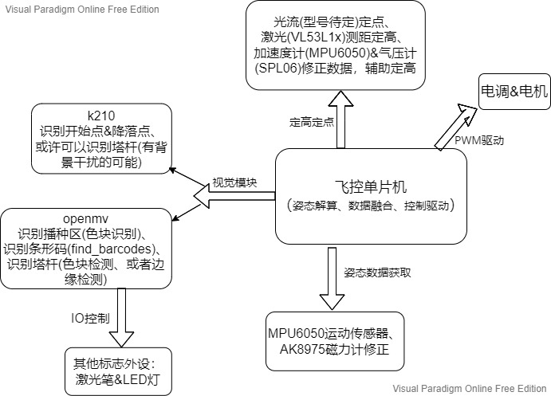

# 2021植保无人机

## 1. 整体方案

- 姿态解算→MPU6050运动传感器(IIC通信) & AK8975磁力计(IIC通信，修正偏航角)（通信速率快，传感器噪声小）
- 视觉模块
  1. 识别播种区&控制激光笔→openmv（stm32H437主控）→色块识别→飞控记录平面运动轨迹，防止重复播撒？/ 或者视觉里程记录运动轨迹（主要依赖定点模块）
  2. 识别起飞点（A）& 降落点（十字）→maixpy（k210主控）→通过模型训练进行识别
  3. 寻找塔杆&扫码&闪烁led灯
     - 寻找塔杆→k210目标检测 / 或者openmv通过色块识别找杆 / 或者边缘检测
     - 扫码→openmv调用API→注意圆环形条形码不平整，可能造成误差→设置镜头畸变？
     - 闪烁led灯→openmv主板自带led
- 定高模块&定点模块→（器件可能在实验箱里）
  - 定高模块
    1. 激光测距(VL53L1x)→在飞行状态突变时，测量不稳定（主要）
    2. 通过加速度计（MPU6050内置） & 气压计（SPL06）进行数据修正（辅助）
  - 定点模块
    →难以抉择
    1. 光流→不准确
    2. 通过视觉系统标定起始点，确定无人机位置
- 系统通信
  主要是IIC，串口通信，可能某些传感器→飞控等主板通信接口不够，需要设计拓展板（或购买）
- 运动驱动
  由飞控单片机输出PWM波驱动电调，从而控制电机

### 系统框图

---

